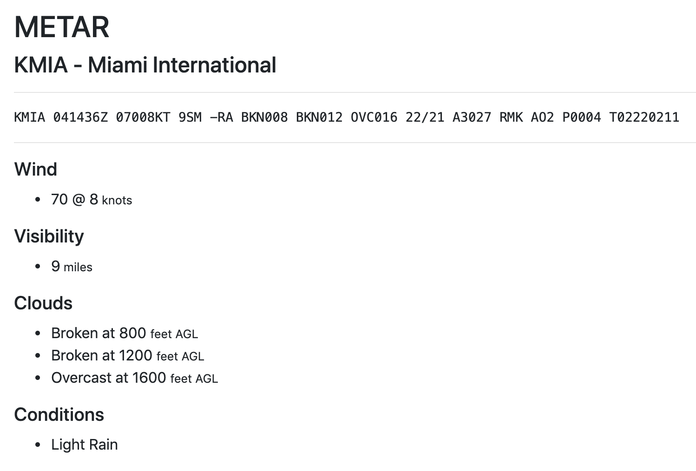

# api.checkwx.com Examples

These are _very simple_ source code examples to help you get started in retreiving and displaying decoded METAR weather reports from [https://api.checkwx.com](https://api.checkwx.com)

### Source Examples

Currently there are three source code examples in this repository.  

* One HTML example written using Javascript
* One HTML example written using jQuery
* One HTML example written using jQuery with ICAO form input
* One HTML example written using PHP
* All examples produce the sample output shown below, some with more data if available

### Notes

* You must use your own API key to run these examples
* You can get a free API key at [https://apidocs.checkwx.com](https://apidocs.checkwx.com)
* The examples do not cover all the METAR fields that are returned from the API
* You can add additional [METAR fields](https://apidocs.checkwx.com/#metarmetar_fields) to any example

### Sample Output:

